# VPN Site-to-Site IPsec entre dos FortiGate

## 🎥 Video demostrativo

**[Ver video en YouTube](https://www.youtube.com/watch?v=RL3TFzFDnzA)**

> Autor: **Erick Abdiel Laureano Martinez** | Matrícula: **2025-0846** | Asignatura: Seguridad de Redes

---

## Tabla de contenido
1. [Propósito del laboratorio](#propósito-del-laboratorio)
2. [Diagrama de la topología](#diagrama-de-la-topología)
3. [Direccionamiento IP](#direccionamiento-ip)
4. [Configuración de red y rutas](#configuración-de-red-y-rutas)
5. [ISP](#isp)
6. [VPN Site-to-Site IPsec](#vpn-site-to-site-ipsec)
7. [Políticas de firewall y NAT](#políticas-de-firewall-y-nat)
8. [Usuarios: VLAN 10, DHCP y traceroute](#usuarios-vlan-10-dhcp-y-traceroute)
9. [Servidor web HTTPS](#servidor-web-https)
10. [Comprobación: la comunicación solo fluye con la VPN activa](#comprobación-la-comunicación-solo-fluye-con-la-vpn-activa)
11. [Evidencias y logs](#evidencias-y-logs)
12. [Running-configs y scripts](#running-configs-y-scripts)

---

## Propósito del laboratorio

Comunicar a un usuario de la sede A con un servidor web de la sede B **a través de un túnel VPN IPsec site-to-site entre dos FortiGate**, con un ISP que provee las IPs públicas, y demostrar que **la comunicación solo fluye si el enlace VPN está activo**. Toda la configuración y la demostración de los FortiGate se hace por la GUI.

| Requisito | Cómo se cumple |
|---|---|
| 2 FortiGate: red, NAT y VPN | Forti-1 y Forti-2 con túnel IPsec, rutas y política NAT de salida |
| ISP con IPs públicas | Router Cisco (R1) con dos enlaces /30 públicos |
| Servidor web /28 con HTTPS | 10.8.46.128/28, Apache con SSL |
| Usuarios /25 en VLAN 10 con DHCP | 10.8.46.0/25, DHCP del Forti-1 en la subinterfaz VLAN10_USERS |
| Traceroute al servidor | Pasa por el FortiGate local y el remoto |

---

## Diagrama de la topología

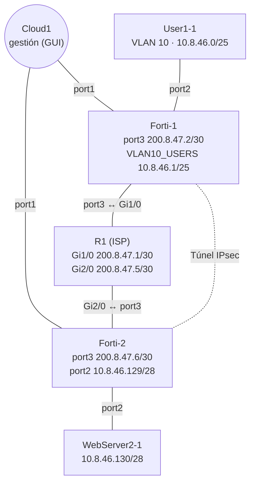

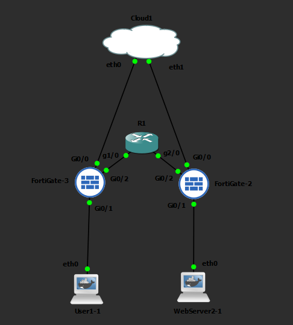

> El Cloud1 se usa solo para acceder a la GUI de cada FortiGate (port1 por DHCP). El tráfico de la práctica pasa por el ISP.

---

## Direccionamiento IP

| Dispositivo | Interfaz | Dirección | Notas |
|---|---|---|---|
| ISP (R1) | Gi1/0 | 200.8.47.1/30 | Hacia Forti-1 |
| ISP (R1) | Gi2/0 | 200.8.47.5/30 | Hacia Forti-2 |
| Forti-1 | port3 (WAN) | 200.8.47.2/30 | Peer de la VPN |
| Forti-1 | VLAN10_USERS (sobre port2) | 10.8.46.1/25 | Gateway y servidor DHCP de usuarios |
| Forti-2 | port3 (WAN) | 200.8.47.6/30 | Peer de la VPN |
| Forti-2 | port2 (LAN) | 10.8.46.129/28 | Gateway del servidor |
| Servidor web | eth0 | 10.8.46.130/28 | Apache HTTPS |
| Usuario | eth0.10 | 10.8.46.10/25 (DHCP) | VLAN 10 |
| Forti-1 / Forti-2 | port1 | DHCP (Cloud) | Solo gestión |

---

## Configuración de red y rutas

### Interfaces
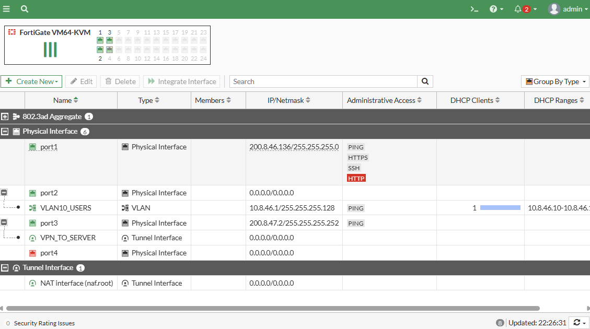

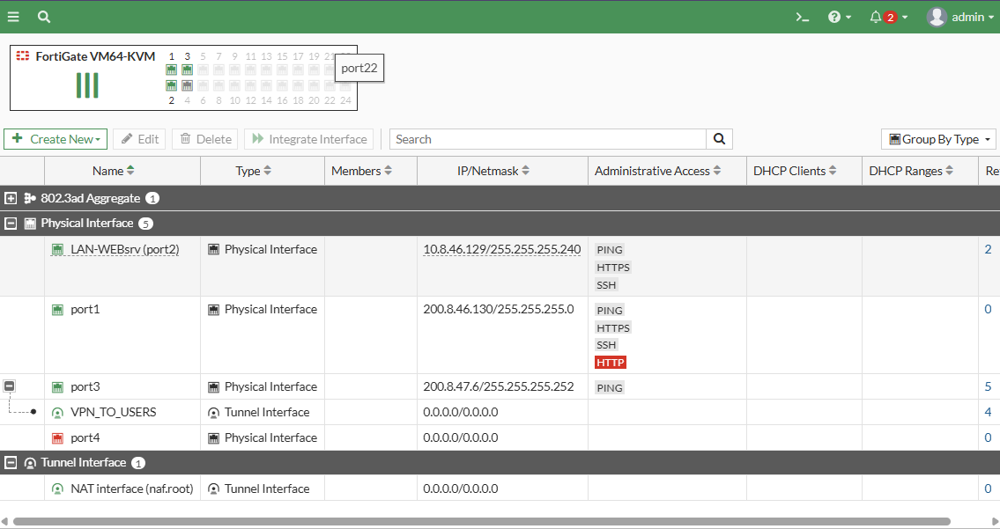

### Rutas estáticas
- **Forti-1:** `200.8.47.4/30` vía `200.8.47.1` (port3) para llegar al peer, y `10.8.46.128/28` por el túnel `VPN_TO_SERVER`.
- **Forti-2:** `200.8.47.0/30` vía `200.8.47.5` (port3), y `10.8.46.0/25` por el túnel `VPN_TO_USERS`.

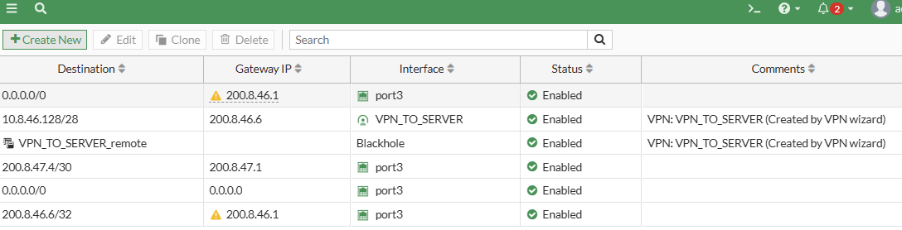

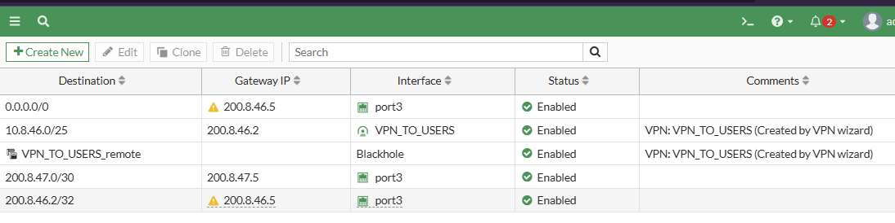

---

## ISP

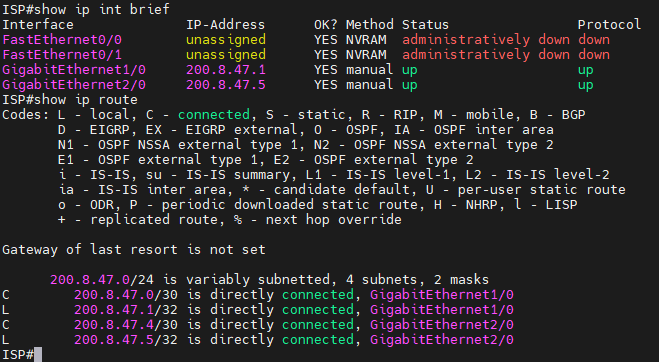

Conectividad entre los peers de la VPN a través del ISP:

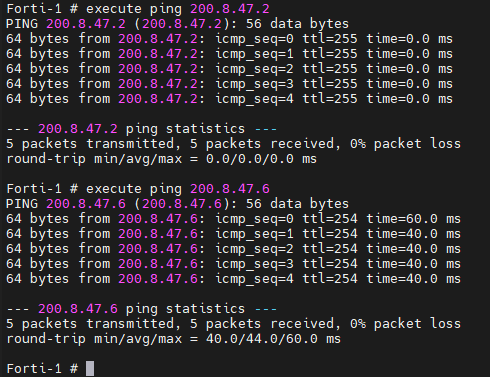

---

## VPN Site-to-Site IPsec

Túnel creado con el asistente de la GUI (VPN → IPsec Wizard, plantilla Site to Site, FortiGate), con clave precompartida y selectores locales/remotos:

| | Forti-1 | Forti-2 |
|---|---|---|
| Nombre del túnel | VPN_TO_SERVER | VPN_TO_USERS |
| Interfaz | port3 | port3 |
| Remote gateway | 200.8.47.6 | 200.8.47.2 |
| Red local | 10.8.46.0/25 | 10.8.46.128/28 |
| Red remota | 10.8.46.128/28 | 10.8.46.0/25 |

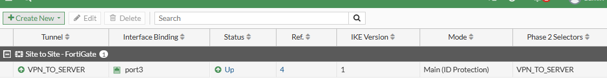

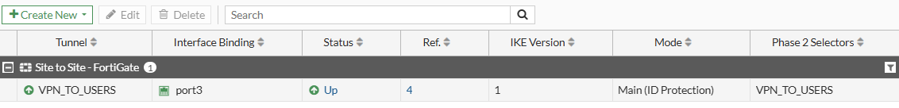

Túnel activo en el monitor:

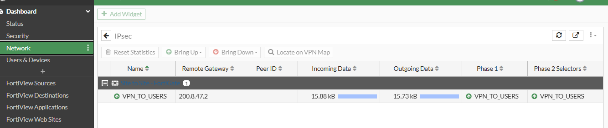

---

## Políticas de firewall y NAT

- `vpn_VPN_TO_SERVER_local_0`: VLAN10_USERS → VPN_TO_SERVER (usuarios hacia el servidor).
- `vpn_VPN_TO_SERVER_remote_0`: VPN_TO_SERVER → VLAN10_USERS (retorno).
- `NAT_INTERNET_USERS`: VLAN10_USERS → port1 con **NAT** habilitado (salida de los usuarios).
- En Forti-2: políticas equivalentes entre `port2` y `VPN_TO_USERS`.

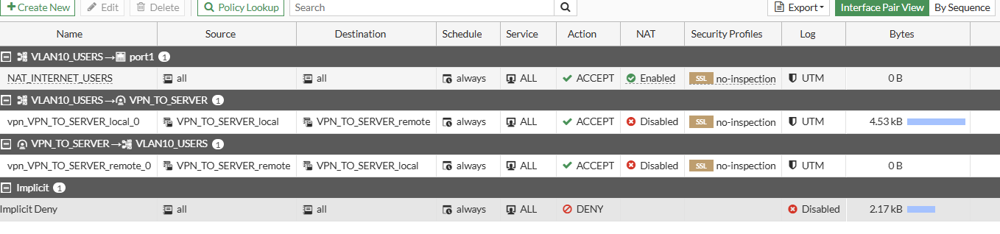

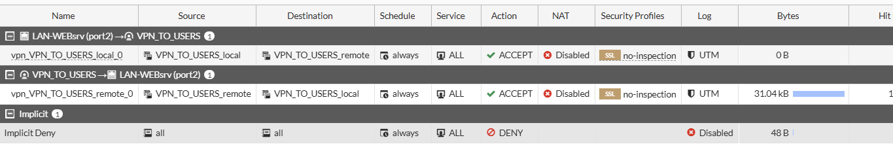

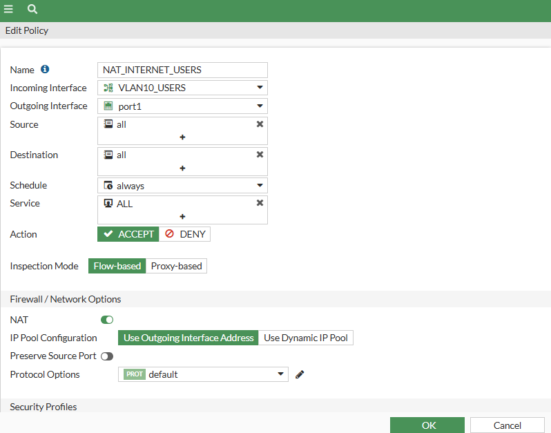

---

## Usuarios: VLAN 10, DHCP y traceroute

El cliente etiqueta la VLAN 10 (`eth0.10`) y recibe IP del servidor DHCP de Forti-1.

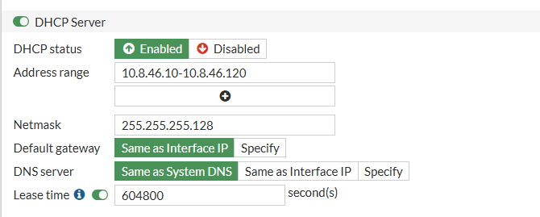

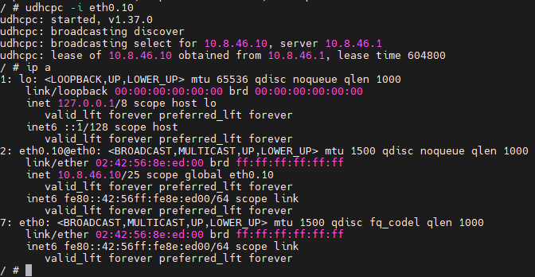

Traceroute al servidor (salto 1: Forti-1, salto 2: Forti-2, salto 3: servidor):

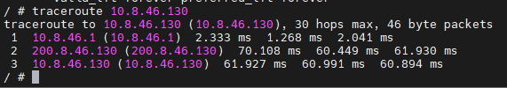

---

## Servidor web HTTPS

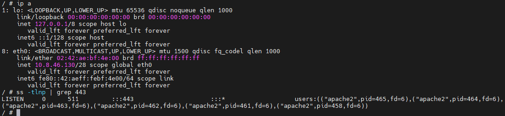

Acceso desde el usuario a través de la VPN:

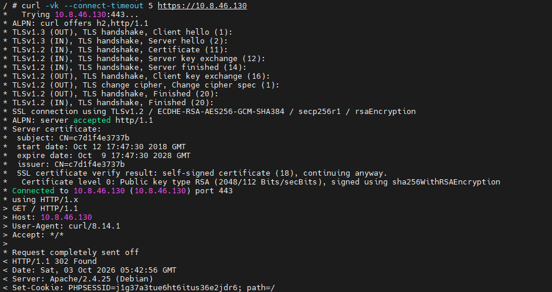

---

## Comprobación: la comunicación solo fluye con la VPN activa

Se desactiva la política `vpn_VPN_TO_SERVER_local_0` (o se baja el túnel) y el usuario pierde acceso al servidor. Al reactivarla, la comunicación se restablece.

1. VPN activa: ping, traceroute y HTTPS responden (capturas 16 y 18).
2. VPN/política desactivada: el ping da 100 % de pérdida y `curl` falla.

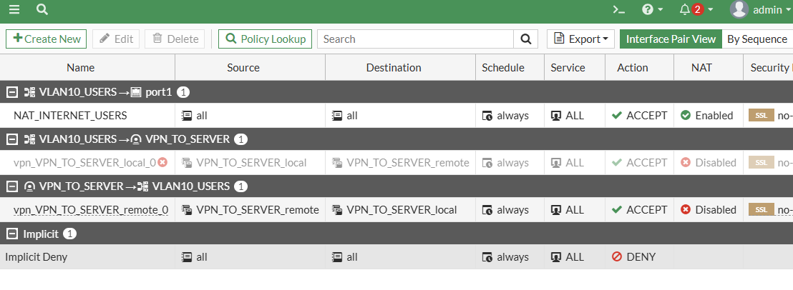

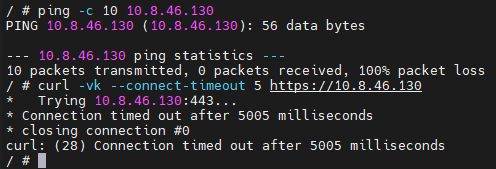

3. Al reactivarla, vuelve a responder:

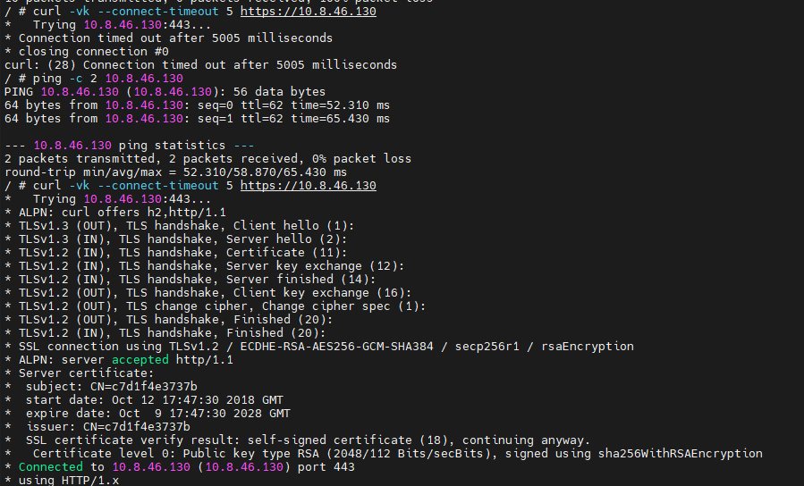

---

## Evidencias y logs

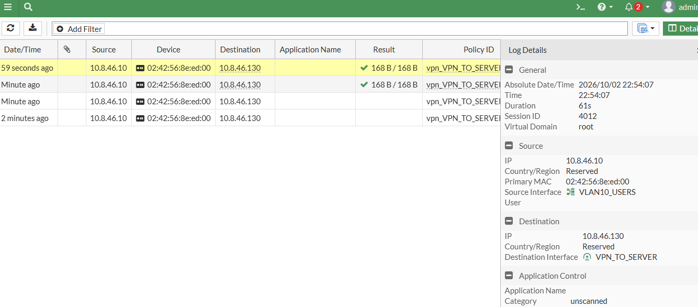

---

## Running-configs y scripts

```
├── README.md
├── configs/
│   ├── forti1-running-config.conf
│   ├── forti2-running-config.conf
│   └── isp-running-config.txt
├── scripts/
│   ├── usuarios-dhcp.sh        # VLAN 10 + DHCP en el cliente
│   ├── webserver-network.txt   # IP fija del contenedor (Edit config de GNS3)
│   ├── webserver-https.sh      # Apache con SSL
│   └── pruebas-usuario.sh      # Ping, traceroute y HTTPS
└── img/
```

- [Forti-1](configs/forti1-running-config.conf) · [Forti-2](configs/forti2-running-config.conf) · [ISP](configs/isp-running-config.txt)
- [Scripts](scripts/)

> Las contraseñas, hashes y claves precompartidas fueron removidos de las configuraciones.
